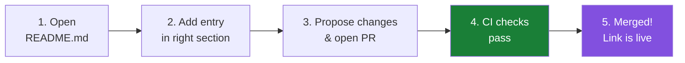
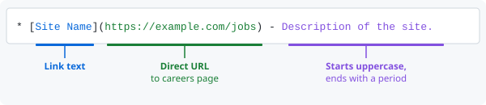

# Contribution Guidelines

Please note that this project is released with a [Contributor Code of Conduct](code-of-conduct.md). By participating in this project you agree to abide by its terms.

## How to add a careers site

Thank you for helping grow this list! To add a new careers site or resource, please open a [pull request](https://help.github.com/articles/using-pull-requests/) against `README.md`.

You'll need a [GitHub account](https://github.com/join) to do this.



### Quick steps

1. Open [`README.md`](README.md) in the GitHub editor (click the pencil ✏️ icon on the file page).
2. Add your entry in the appropriate section (e.g. **General**, **Fellowships**, **Subfields**, or **Regional**). If no existing section fits, propose a new one.
3. Follow the entry format described below.
4. Scroll down, describe your change, and click **Propose changes**.
5. Click **Create pull request** on the comparison page and submit.

### Entry format

Entries must follow the [awesome list](https://github.com/sindresorhus/awesome/blob/main/contributing.md) syntax:

```markdown
* [Site Name](https://example.com) - One-sentence description of the site.
```



- The description must start with a capital letter and end with a period.
- Keep the description concise — one sentence only.
- The URL must be the direct link to the jobs/careers page, not a homepage, unless the homepage *is* the jobs listing.
- Entries within a section should be added in alphabetical order.

### Choosing the right category

Place your entry in the section that best fits. Use the table below as a guide:

| Section | What to put here |
|---|---|
| **General** | Broad job boards, professional societies, and general aggregators |
| &nbsp;&nbsp;↳ Contracting companies | Staffing and government contracting firms |
| **Fellowships** | Formal fellowship and training programs |
| **Subfields** | Specialized or niche areas within bioinformatics |
| **Regional** | Country or region-specific job boards |
| &nbsp;&nbsp;↳ Country name | Add a new `### Country` subsection under Regional |

If you are unsure which section fits, leave a comment on your pull request and a maintainer will help.

### What makes a good entry

- The site is genuinely useful to someone looking for bioinformatics jobs.
- The site is publicly accessible (no paywall or login required to browse listings).
- The link is stable and not likely to disappear soon.

### Automated checks

Every pull request is automatically checked by [awesome-lint](https://github.com/sindresorhus/awesome-lint) via CI. Your PR must pass these checks before it can be merged. Common reasons for failures include:

- Missing or malformed description (wrong capitalization, no trailing period).
- Duplicate entries.
- Broken or non-HTTPS URLs.

If your PR fails CI, review the error output in the **Checks** tab and push a fix to the same branch.

## Updating your Pull Request

If a maintainer asks you to make changes, or CI reports an error, you can push additional commits to the same branch and the PR will update automatically.

[Here](https://github.com/RichardLitt/knowledge/blob/master/github/amending-a-commit-guide.md) is a guide on amending commits in a pull request.
